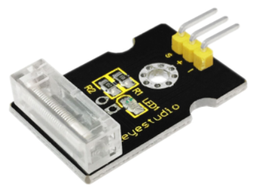
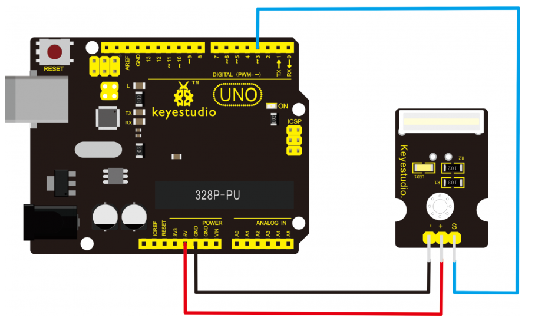
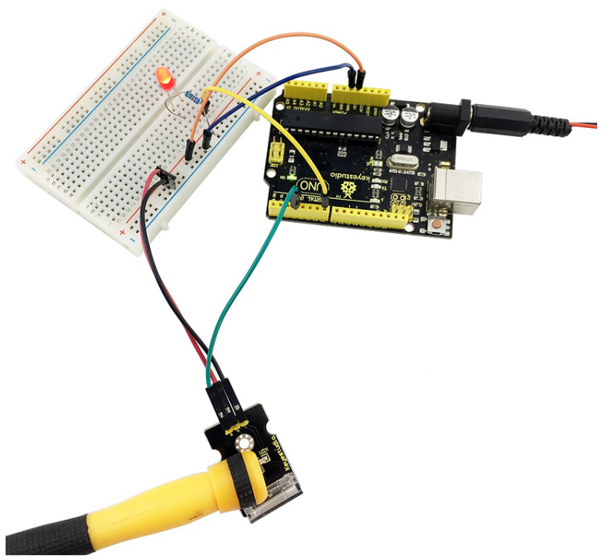

# KS0024 keyestudio Knock Sensor Module

## 1. Introduction

This is a knock sensor module. When you knock it, it can send a momentary signal. You can combine it with Arduino to make some interesting experiment, e.g. electronic drum.

- Working voltage: 5V



## 2. Connection Diagram



## 3. Sample Code

Download code: [Code](./Code.7z)

```
int Led=13;//define LED interface
int Shock=3;//define knock sensor interface
int val;//define digital variable val

void setup()
{
    pinMode(Led,OUTPUT);//define LED to be output interface
    pinMode(Shock,INPUT);//define knock sensor to be output interface
}

void loop()
{
    val=digitalRead(Shock);//read the value of interface3 and evaluate it to val
    if(val==HIGH)//when the knock sensor detect a signal, LED will be flashing
    {
    	digitalWrite(Led,LOW);
    }
    else
    {
    	digitalWrite(Led,HIGH);
    }
}
```

Upload the code to the board. When the sensor detects a knock signal, both the led on the sensor and led 13 on the UNO board are turned on.

## 4. Extension

You can extend to connect an external LED; when knock the sensor, the external LED will turn on. For example:

